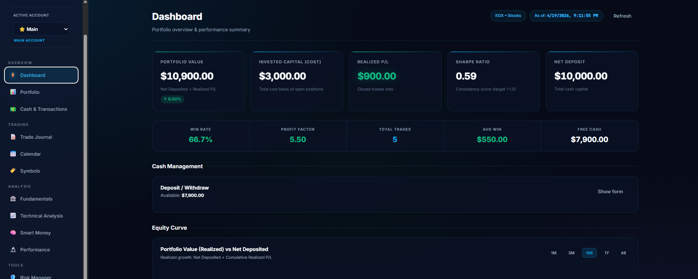
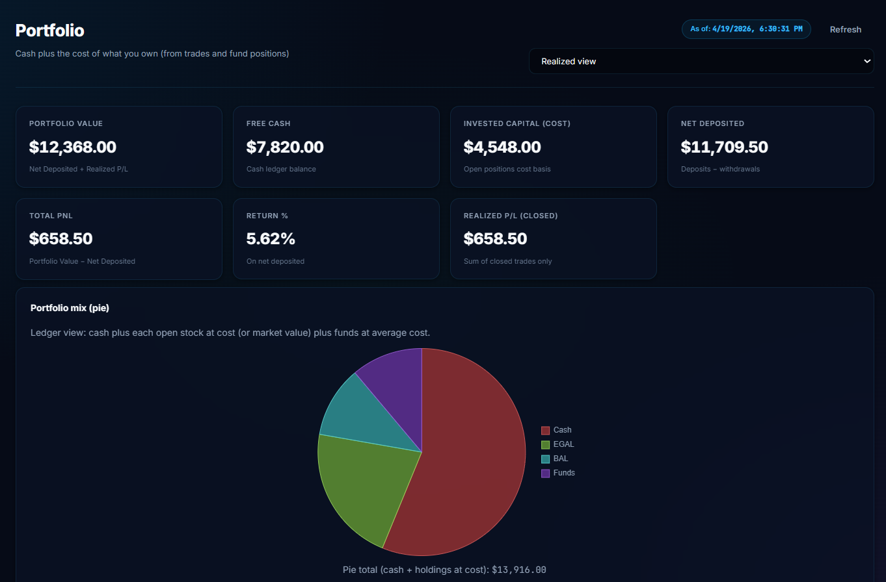
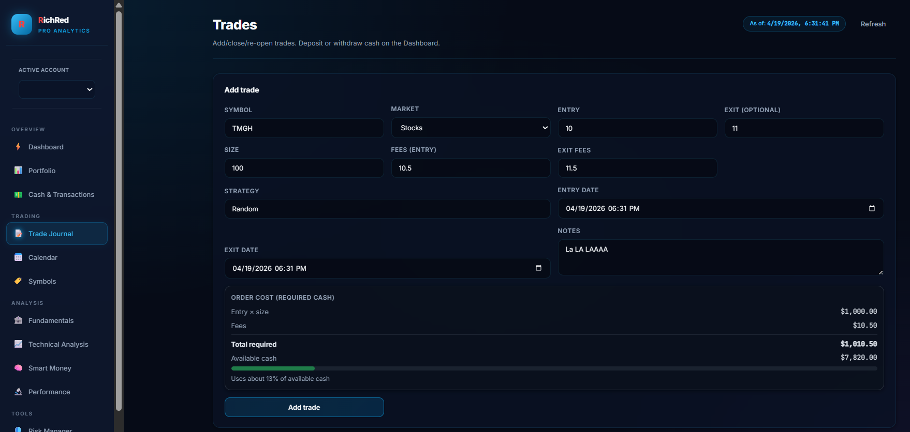
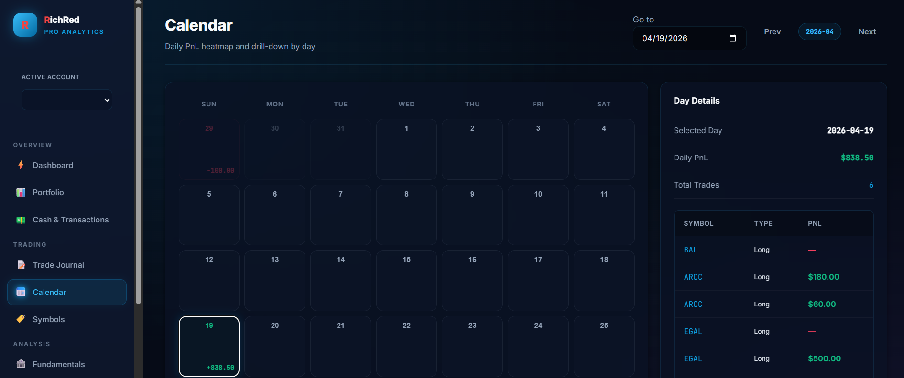
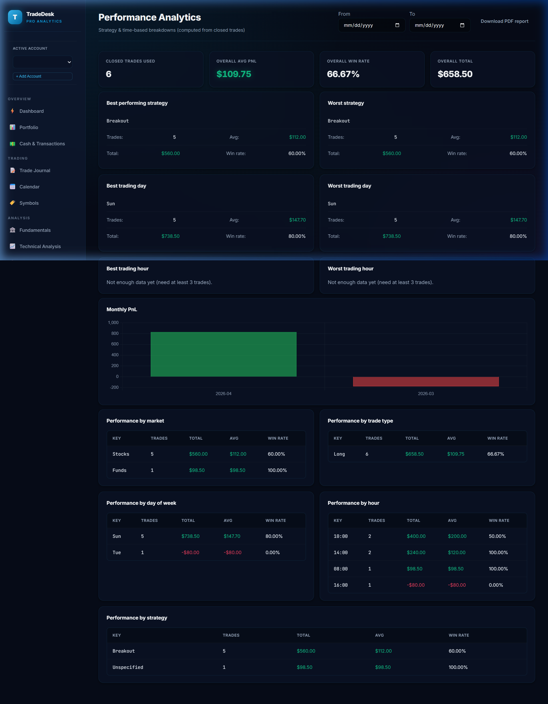
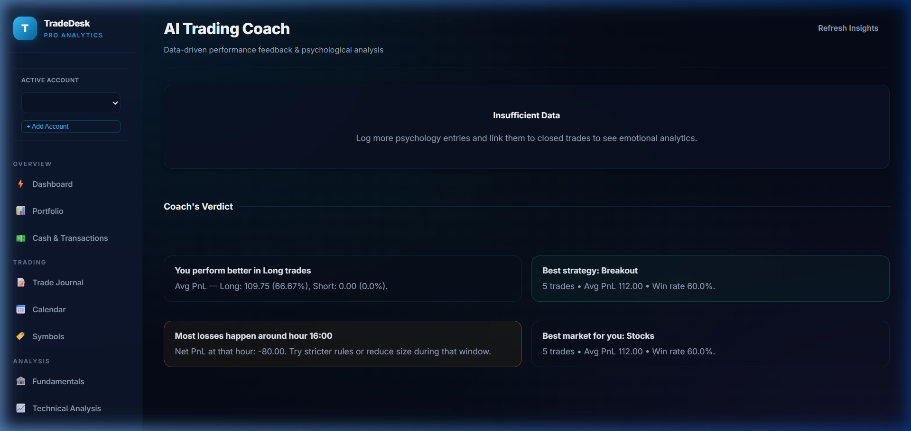
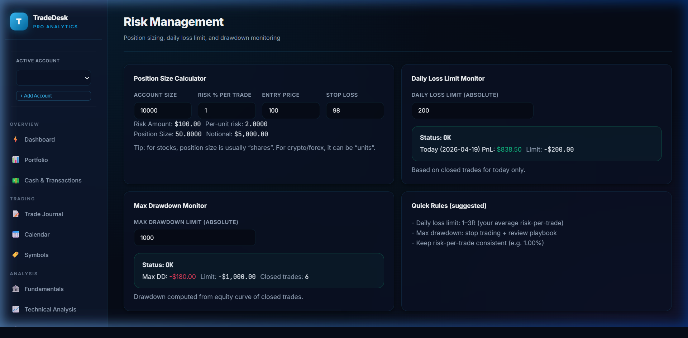
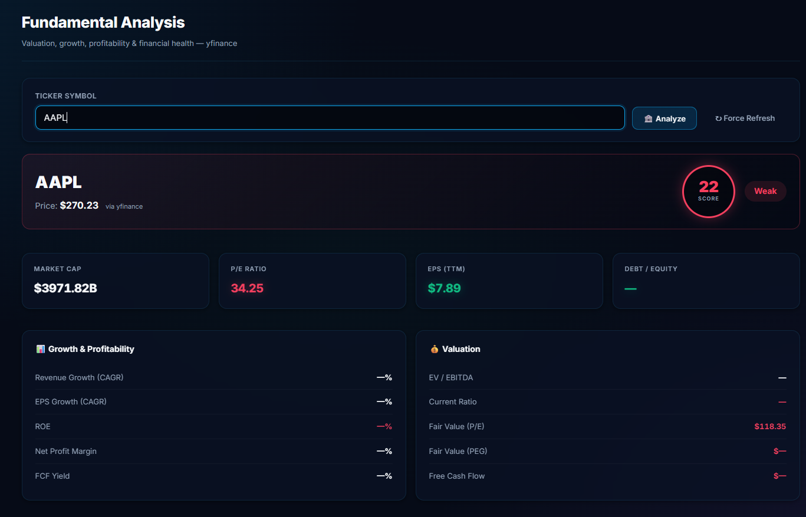
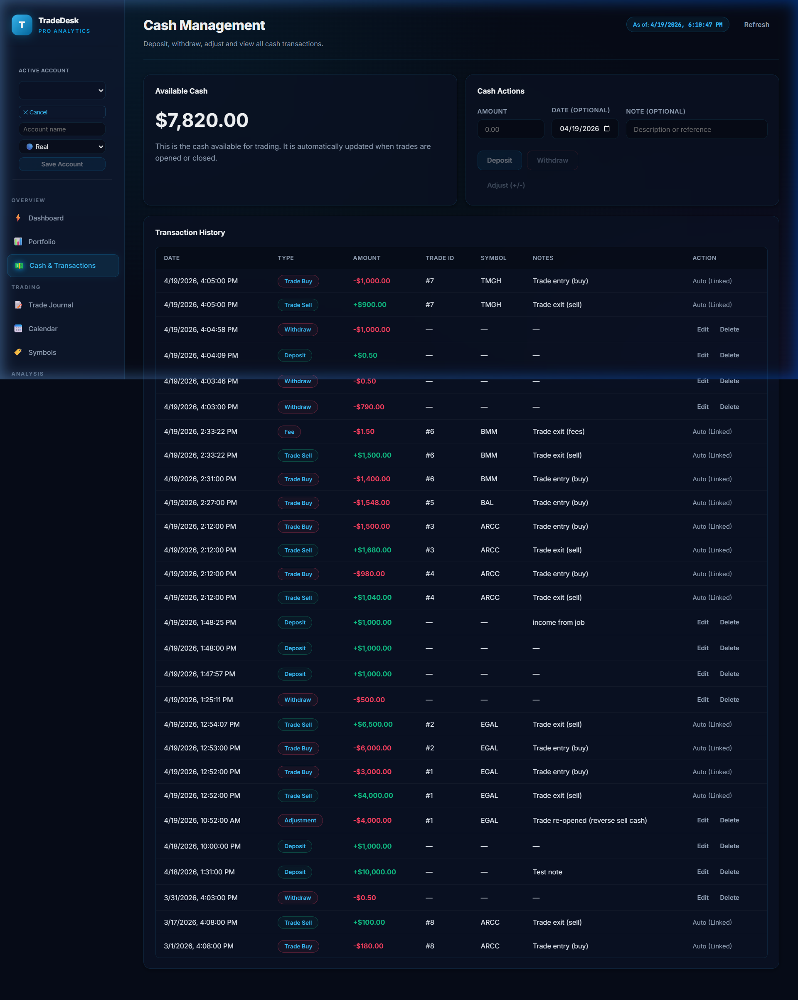
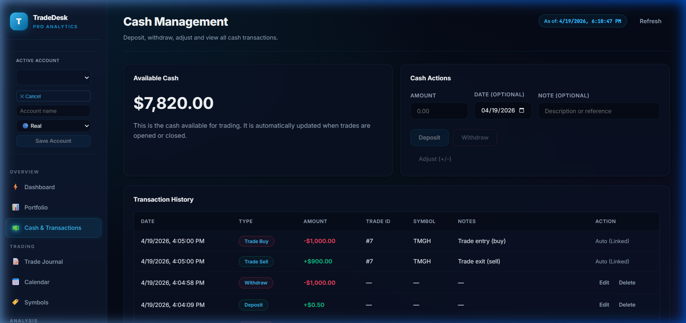

# 🚀 Trading Analytics Platform

A powerful, data-driven trading journal and analytics dashboard for EGX and global stocks. Track your trades, analyze your psychology, and optimize your performance with AI-driven insights.

## ✨ Key Features

### 📊 Dashboard
The central hub for your trading activity. View your equity curve, portfolio allocation, and manage your cash balance.
- **Cash Management**: Quickly deposit or withdraw funds to keep your ledger up to date.
- **Allocation Radar**: Visualize your asset distribution across Stocks, Cash, and Funds.
- **Equity Curve**: Track your portfolio growth (Realized vs. Liquidation value).



### 📁 Portfolio
Detailed breakdown of your current holdings and cash balance.
- **Asset Mix**: Pie chart visualization of your total exposure.
- **Position Tracking**: Monitor open quantities, average cost, and unrealized P&L.



### 📓 Trade Journal
A comprehensive log of all your trades with search and filter capabilities.
- **Trade Details**: Log entries, exits, strategies, and lessons learned.
- **Performance Metrics**: Automatic calculation of P&L, Win Rate, and Risk/Reward.



### 📅 Calendar
Visualize your trading performance over time. See your wins and losses mapped to a monthly calendar.



### 📈 Analytics
Deep-dive into your performance with strategy and time-based breakdowns.
- **Performance by Strategy**: Identify your most profitable trading setups.
- **Time Analysis**: See which days of the week or hours of the day you perform best.



### 🤖 AI Trading Coach
Data-driven feedback on your trading habits and emotional state.
- **Emotional Balance**: Radar chart showing the distribution of your logged emotions.
- **Coach's Verdict**: Automatic insights based on your trade history (e.g., "Stop trading when Fearful").



### 🛡️ Risk Management
Keep your capital safe with built-in risk tools.
- **Position Sizing**: Calculate the correct size for your next trade based on your risk tolerance.
- **Loss Limits**: Monitor your daily loss limit and maximum drawdown in real-time.



### 🔬 Advanced Analysis
- **Fundamentals**: Detailed stock metrics including P/E ratio, revenue growth, and debt-to-equity.
- **Technical Analysis**: Real-time technical indicators and chart patterns.
- **Smart Money Flow**: Track institutional buying and selling pressure.





---

## 🛠️ Technology Stack
- **Frontend**: React, Vite, Chart.js, TanStack Query.
- **Backend**: FastAPI (Python), SQLAlchemy, SQLite.
- **Desktop**: Electron (Optional wrapper).

---

## 🚀 Getting Started

### Prerequisites
- Node.js (v18+)
- Python (3.10+)

### Installation

1. **Clone the repository**:
   ```bash
   git clone <repository-url>
   cd trading-app-curser
   ```

2. **Install Frontend Dependencies**:
   ```bash
   npm install
   ```

3. **Install Backend Dependencies**:

   **On Windows**:
   ```bash
   cd apps/api
   python -m venv .venv
   .venv\Scripts\activate
   pip install -r requirements.txt
   cd ../..
   ```

   **On macOS/Linux**:
   ```bash
   cd apps/api
   python -m venv .venv
   source .venv/bin/activate
   pip install -r requirements.txt
   cd ../..
   ```

### Running the App

Start both the API and the Desktop frontend concurrently:
```bash
npm run dev
```

The API will start on `http://127.0.0.1:8001` and the frontend on `http://localhost:5173`.

---

## 📁 Project Structure
- `apps/api`: FastAPI backend and database models.
- `apps/desktop`: React frontend application.
- `packages/shared`: Shared types and utilities.
- `media`: Screenshots and assets for documentation.
